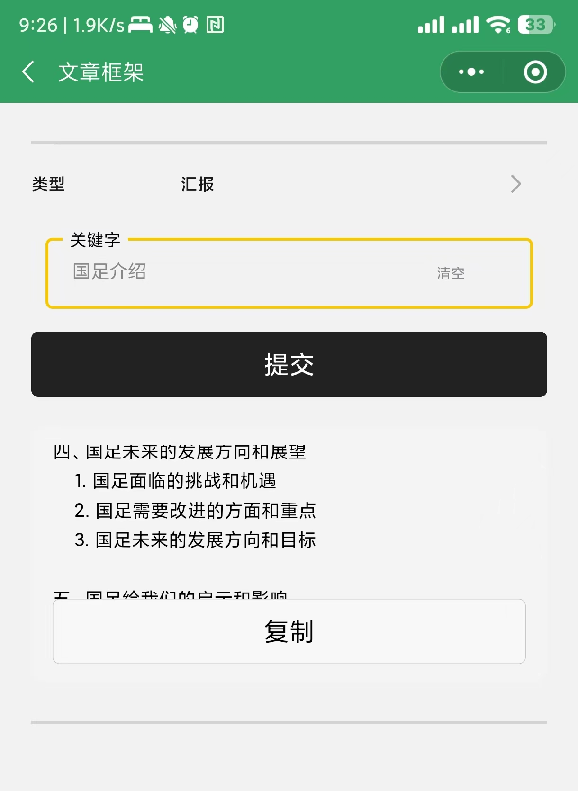
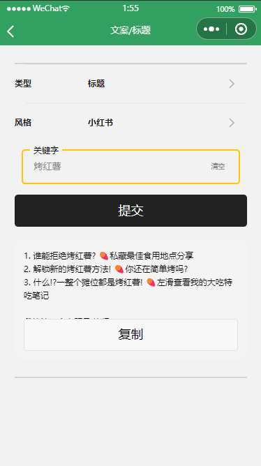

# ChatGPT 生成器小程序

**⚡** **已接入最新gpt-3.5-turbo模型**

码云链接：``https://gitee.com/JN910-14/ChatGPT-miniapp``

## 🔧 环境要求

1.科学上网

2.注册获取key


## ⚙已有功能

* 日报周报生成
* 文章框架生成
* 文案标题生成
* 检讨书生成
* 理由推脱
* 评价生成
* 个人总结
* 好物描述
* 肯德基V50
* ......


## **⚡** 上图不多说

**图片地址有问题，想看图的看附上的PDF吧，得睡了**






## 🦊在线体验


> or wx 搜 万用生成器 
>
> 目前服务器较不稳定，如果出现请求延迟or无法访问，属于正常现象，休息一下重试即可！


## 👻交流or反馈

* 有交流or反馈，可以扫PDF二维码联系

* 服务器搭建/项目部署问题，可以扫PDF二维码联系


# ⚡最后

我是业余前端开发的全栈，前端代码是扒拉模板二开的，代码写得有点拉我不负责的哈哈哈，如果有人感兴趣的话，我再把后台也附上吧。

后台地址

```
https://github.com/Rlvse/ChatGPT-miniapp-backend
```

